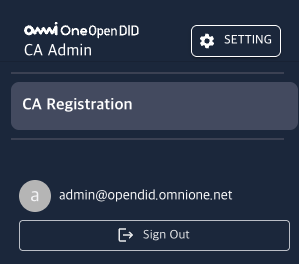
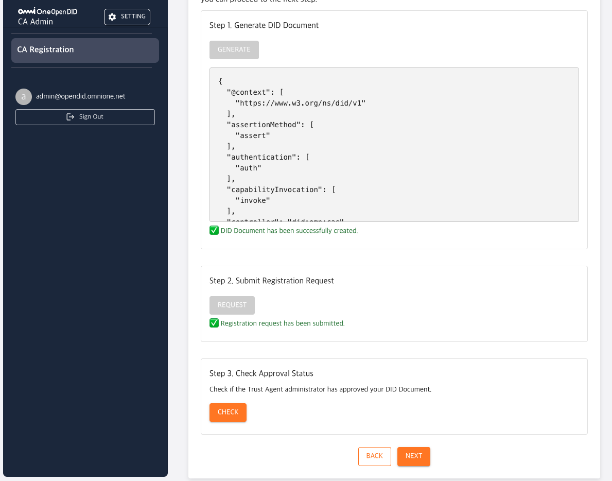
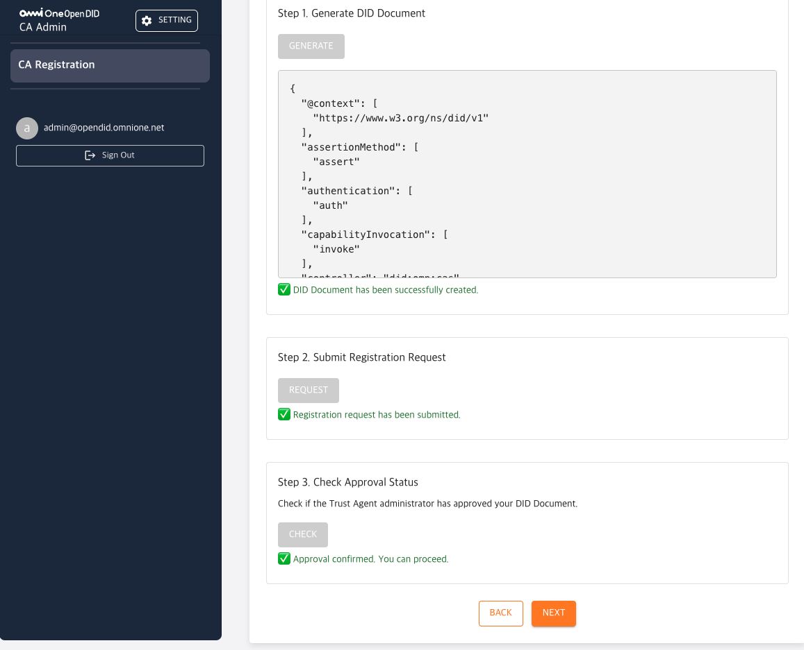
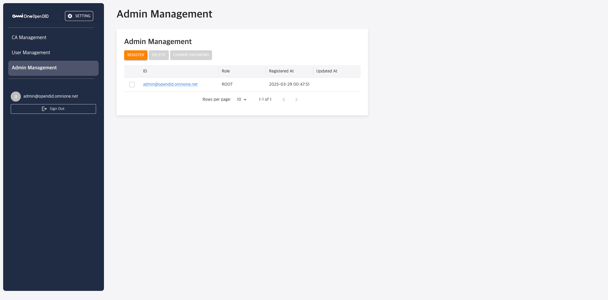
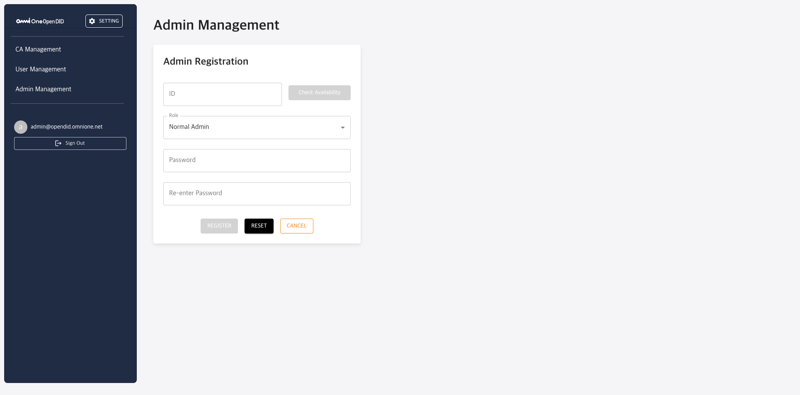

---
puppeteer:
    pdf:
        format: A4
        displayHeaderFooter: true
        landscape: false
        scale: 0.8
        margin:
            top: 1.2cm
            right: 1cm
            bottom: 1cm
            left: 1cm
    image:
        quality: 100
        fullPage: false
---

Open DID CA Admin Operation Guide
==

- Date: 2025-05-29
- Version: v2.0.0

Revision History
==
| Version | Date       | Changes                            |
| ------- | ---------- | ---------------------------------- |
| v1.0.0  | 2025-03-31 | Initial version                    |
| v1.0.1  | 2025-04-24 | Added `3.1.1. CA Registration` chapter |
| v2.0.0  | 2025-05-29 | Version update                     |

Table of Contents
==

- [1. Introduction](#1-introduction)
  - [1.1. Overview](#11-overview)
  - [1.2. Admin Console Definition](#12-admin-console-definition)
- [2. Basic Manual](#2-basic-manual)
  - [2.1. Login](#21-login)
  - [2.2. Main Screen Configuration](#22-main-screen-configuration)
  - [2.3. Menu Configuration](#23-menu-configuration)
    - [2.3.1. CA Unregistered State](#231-ca-unregistered-state)
    - [2.3.2. CA Registered State](#232-ca-registered-state)
  - [2.4. Password Change Management](#24-password-change-management)
- [3. Feature-specific Detailed Manual](#3-feature-specific-detailed-manual)
  - [3.1. CA Management](#31-ca-management)
    - [3.1.1. CA Registration](#311-ca-registration)
    - [3.1.2. Registered CA Management](#312-registered-ca-management)
  - [3.2. User Management](#32-user-management)
    - [3.2.1. User List Inquiry](#321-user-list-inquiry)
    - [3.2.2. User Detailed Information Inquiry](#322-user-detailed-information-inquiry)
  - [3.3. Admin Management](#33-admin-management)
    - [3.3.1 Admin List Inquiry](#331-admin-list-inquiry)
    - [3.3.2. Admin Registration](#332-admin-registration)

# 1. Introduction

## 1.1. Overview

This document provides a guide on how to use the Open DID CA Admin Console. It explains the features and usage methods step by step so that administrators can efficiently manage and operate the CA (Client Application) system.

For the overall installation guide of OpenDID, please refer to [Open DID Installation Guide].

## 1.2. Admin Console Definition

The CA Admin Console is a web-based management tool for managing core functions of the CA server in the Open DID system, including certificate issuance, user management, and administrator privilege control. Administrators can monitor the overall status of the system and perform necessary configurations and tasks through this console.

The CA Admin Console provides the following main features:

- CA basic information management
- User information inquiry
- Administrator account management

<br/>

# 2. Basic Manual

## 2.1. Login

To access the Admin Console, follow these steps:

1. Open a web browser and access the CA Admin Console URL.

   ```
   http://<ca_domain>:<port>
   ```

2. On the login screen, enter the administrator account email and password.
   - Default administrator account: <admin@opendid.omnione.net>
   - Initial password: password (must be changed upon first login)

3. Click the 'Login' button.

> **Note**: For security reasons, password change is required upon first login.

<br/>

## 2.2. Main Screen Configuration

The main screen displayed after login consists of the following elements:


| Number | Area             | Description                                                                                                                     |
| ------ | ---------------- | ------------------------------------------------------------------------------------------------------------------------------- |
| 1      | Header Area      | You can navigate to the password change screen through the `SETTING` button in the upper right corner.                         |
| 2      | Content Area     | Displays the title of the currently selected menu and its corresponding content. Screen content changes according to each menu. |
| 3      | Side Menu        | Located on the left side of the screen, with main menu items arranged vertically. Selected menu is highlighted, and sub-menus expand when necessary. |
| 4      | User Info Area   | Displays the email address of the currently logged-in administrator and the 'Sign Out' button.                                  |

<br/>

## 2.3. Menu Configuration

The sidebar menu of the CA Admin Console **differs in screen configuration depending on the CA registration status**.

<br/>

### 2.3.1. CA Unregistered State

In the initial state where the CA server is not yet registered, only the `CA Registration` item is displayed alone in the menu.



### 2.3.2. CA Registered State

Once CA registration is completed, all management functions are activated, and the sidebar menu is configured as follows:


| Number | Function Name | Function Description |
|--------|---------------|---------------------|
| 1 | **CA Management** | Menu to check and manage basic information of the CA server (DID, URL, etc.). |
| 2 | **User Management** | Menu to inquire about user information registered in the system. You can check users' personally identifiable information (PII). |
| 3 | **Admin Management** | Menu to manage administrator-related settings. You can adjust administrator accounts and permissions. |

Detailed functions for each menu are explained in detail in the [3. Feature-specific Detailed Manual](#3-feature-specific-detailed-manual) section.

<br/>

## 2.4. Password Change Management

User password change can be performed through the following steps:

1. Click the 'SETTING' button in the header area.
2. Select 'Password Change' from the settings menu.
3. On the password change screen:
   - Enter current password
   - Enter new password
   - Confirm new password
4. Click the 'Save' button to apply changes.

> **Note**: Password must be at least 8 characters and no more than 64 characters.

<br/>

# 3. Feature-specific Detailed Manual

This chapter guides you through the detailed usage methods for the main features of the Open DID CA Admin Console.

## 3.1. CA Management

CA Management is a function for registration and status management of CA servers.

The CA server plays a role in guaranteeing users' Client Applications in the Open DID system.
Client Applications can use main functions such as DID creation and VC issuance using Wallet after being authenticated through the CA server.

CA registration is performed only once initially, and afterwards, you can check the registered status on the management screen.

<br/>

### 3.1.1. CA Registration

In the initial state where the CA server is not yet registered in the Open DID system,
only the `CA Registration` item is displayed in the left menu of the CA Admin Console.

CA registration proceeds sequentially through a total of 3 steps.

<br/>

**Step 1 - Enter CA Info**

This is the step to enter CA information.


| Item              | Description                                                              |
| ----------------- | ------------------------------------------------------------------------ |
| **Name**          | Enter the name of the CA server. Example: `cas`                        |
| **CA URL**        | Enter the call URL of the CA server. Use format `http://<IP>:8094/cas` |
| **Test Connection Button** | Check if actual connection is possible with the entered URL.      |
| **NEXT Button**   | Move to the next step.                                                   |

<br/>

**Step 2 - Register DID Document**

In this step, the CA's DID Document is created and a registration request is made to TA Admin.
Once registered, the DID Document **cannot be changed or re-registered**.

▶ **Step 2-1: Generate DID Document**

Generate the CA's DID Document.


| Item               | Description                                                             |
| ------------------ | ----------------------------------------------------------------------- |
| **GENERATE Button** | Generate the CA server's DID Document. Results are displayed in the lower area after generation |
| **Request Status Display** | Can be confirmed with green message when request is successful.    |

When the DID Document is successfully generated, **Step 2-2 area is automatically displayed on the screen**.

<br/>

▶ **Step 2-2 - Submit Registration Request**

Request registration of the generated DID Document to TA Admin.




| Item              | Description                                                              |
| ----------------- | ------------------------------------------------------------------------ |
| **REQUEST Button** | Send registration request for the generated DID Document to TA Admin.  |
| **Request Status Display** | Can be confirmed with green message when request is successful.    |

When the DID Document is successfully generated, **Step 2-3 area is automatically displayed on the screen**.

<br/>

▶ **Step 2-3 - Check Approval Status**

Check if the TA administrator has approved the DID Document registration request.



| Item              | Description                                                              |
| ----------------- | ------------------------------------------------------------------------ |
| **CHECK Button**  | Check if the TA administrator has approved the registration request.     |
| **Approval Status Display** | When approval is complete, you can move to the next step with a green message. |

<br/>

**Step 3 - Enroll Entity**

This is the step to request CA registration as an Entity to the TA server and receive a Certificate VC.

At this time, the registration request follows the flow of the user registration protocol (P132) among TA protocols,
and CA Admin performs the registration procedure by calling the APIs of that protocol.


| Item        | Description                                        |
| ----------- | -------------------------------------------------- |
| **REQUEST** | Send Entity registration request to TA server.     |
| **FINISH**  | Complete registration and move to final completion status. |

<br/>

### 3.1.2. Registered CA Management


| Number | Item              | Description                                                                                                                    |
| ------ | ----------------- | ------------------------------------------------------------------------------------------------------------------------------ |
| 1      | **DID**           | Unique identifier of the CA. Displayed in format like 'did:omn:ca'.                                                          |
| 2      | **Name**          | Name of the CA. Name displayed when issuing VC.                                                                               |
| 3      | **Status**        | Indicates the activation status of the CA. ACTIVATE or DEACTIVATE status is displayed.                                        |
| 4      | **URL**           | Basic URL address of the CA service.                                                                                          |
| 5      | **Certificate URL** | URL address where you can check the CA's membership certificate.                                                             |
| 6      | **Registered At** | Displays the date and time when the CA was registered.                                                                        |
| 7      | **VIEW DID DOCUMENT** | Button to check the DID document. When clicked, DID document information registered on the blockchain is displayed in popup form. |

<br/>

## 3.2. User Management

The User Management menu provides functionality to inquire about user information registered in the system. Through this function, administrators can check users' personally identifiable information (PII).

### 3.2.1. User List Inquiry


The User Management screen displays the following main information:

| Number | Item | Description |
|--------|------|-------------|
| 1 | ID | Unique identifier of the user. Click to view detailed information. |
| 2 | PII | Personally identifiable information of the user. |
| 3 | Registered At | Displays the date and time when the user was registered. |
| 4 | Updated At | Displays the date and time when user information was last updated. |
| 5 | Pagination | Manages pages of the user list. You can check the number of rows to display per page and current page information. |

> **Note**: Only read access is available on the user list screen; functions for adding, modifying, or deleting user information are not provided.

<br/>

### 3.2.2. User Detailed Information Inquiry

You can inquire about detailed information of a user by clicking the user ID in the user list.


The following information is displayed on the user detailed information screen:

| Section | Included Information |
|---------|---------------------|
| **Basic Information** | - ID<br>- PII<br>- Registered At<br>- Updated At |

> **Important**: Personally identifiable information (PII) is currently arbitrary values entered through the Demo Server in the system. The CA server provides this inquiry function for configuration where it has user information.

<br/>

## 3.3. Admin Management

The `Admin Management` menu is a function to manage administrator accounts that can access the CA Admin Console.

When the CA server is installed, the `admin@opendid.omnione.net` account is automatically created with ROOT privileges by default.
This account is the only ROOT account in the system and cannot be deleted.

Administrator accounts are divided into two privilege types: **ROOT** and **Normal Admin**.
ROOT accounts can perform all functions in the `Admin Management` menu, while Normal Admin can only perform general inquiry functions.

---
> **Note:** Currently, the privilege difference between ROOT accounts and Normal Admin accounts  
> is only in the button differences displayed in the `Admin Management` menu (only Root can REGISTER / DELETE / CHANGE PASSWORD).  
> Other access permissions or functional restrictions for other menus in the system are not yet applied.
---

<br/>

### 3.3.1 Admin List Inquiry

When entering the `Admin Management` menu, a list of registered administrator accounts is displayed in table format.



| Number | Item                    | Description                                                          |
| ------ | ----------------------- | -------------------------------------------------------------------- |
| 1      | **REGISTER Button**     | Navigate to registration page where you can register new administrator accounts. |
| 2      | **DELETE Button**       | Delete selected administrator account. (Only ROOT administrator can do this) |
| 3      | **CHANGE PASSWORD Button** | Change password of selected administrator account.               |
| 4      | **ID**                  | Email ID of registered administrator account.                        |
| 5      | **Role**                | Role of the administrator account. (e.g., ROOT, Normal Admin, etc.)  |
| 6      | **Registered At**       | Date and time when the account was initially registered.             |
| 7      | **Updated At**          | Date and time when it was last modified.                            |

<br/>

### 3.3.2. Admin Registration

When you click the **REGISTER** button on the `Admin Management` screen, you will be taken to the registration screen as shown below.



| Number | Item                        | Description                                                         |
| ------ | --------------------------- | ------------------------------------------------------------------- |
| 1      | **ID**                      | ID of the administrator account to register. Must use email format. |
| 2      | **Check Availability Button** | Check if the entered ID is not duplicated.                       |
| 3      | **Role**                    | Select the privilege of the administrator account to register. (e.g., Normal Admin) |
| 4      | **Password**                | Enter password to use for login.                                   |
| 5      | **Re-enter Password**       | Enter password once more to check if it matches.                   |
| 6      | **REGISTER Button**         | Register administrator account based on entered information.        |
| 7      | **RESET Button**            | Initialize all input values.                                        |
| 8      | **CANCEL Button**           | Cancel registration and return to previous screen.                 |

[Open DID Installation Guide]: https://github.com/OmniOneID/did-release/blob/develop/release-V2.0.0.0/OpenDID_Installation_Guide-V2.0.0.0_ko.md