---
puppeteer:
    pdf:
        format: A4
        displayHeaderFooter: true
        landscape: false
        scale: 0.8
        margin:
            top: 1.2cm
            right: 1cm
            bottom: 1cm
            left: 1cm
    image:
        quality: 100
        fullPage: false
---

Open DID CA Admin Operation Guide
==

- Date: 2025-04-24
- Version: v1.0.1

개정 이력
==
| 버전   | 일자       | 변경 내용                  |
| ------ | ---------- | -------------------------- |
| v1.0.0 | 2025-03-31 | 최초 작성                  |
| v1.0.1 | 2025-04-24 | `3.1.1. CA 등록` 장 추가 |

목차
==

- [1. 소개](#1-소개)
  - [1.1. 개요](#11-개요)
  - [1.2. Admin Console 정의](#12-admin-console-정의)
- [2. 기본 메뉴얼](#2-기본-메뉴얼)
  - [2.1. 로그인](#21-로그인)
  - [2.2. 메인 화면 구성](#22-메인-화면-구성)
  - [2.3. 메뉴 구성](#23-메뉴-구성)
    - [2.3.1. CA 미등록 상태](#231-ca-미등록-상태)
    - [2.3.2. CA 등록 상태](#232-ca-등록-상태)
  - [2.4. 비밀번호 변경 관리](#24-비밀번호-변경-관리)
- [3. 기능별 상세 메뉴얼](#3-기능별-상세-메뉴얼)
  - [3.1. CA Management](#31-ca-management)
    - [3.1.1. CA 등록](#311-ca-등록)
    - [3.1.2. 등록된 CA 관리](#312-등록된-ca-관리)
  - [3.2. User Management](#32-user-management)
    - [3.2.1. 사용자 목록 조회](#321-사용자-목록-조회)
    - [3.2.2. 사용자 상세 정보 조회](#322-사용자-상세-정보-조회)
  - [3.3. Admin Management](#33-admin-management)
    - [3.3.1 Admin 목록 조회](#331-admin-목록-조회)
    - [3.3.2. Admin 등록](#332-admin-등록)

# 1. 소개

## 1.1. 개요

본 문서는 Open DID CA Admin Console의 사용 방법에 관한 가이드를 제공합니다. 관리자가 CA(Client Application) 시스템을 효율적으로 관리하고 운영할 수 있도록 기능 및 사용 방법을 단계별로 설명합니다.

OpenDID의 전체 설치에 대한 가이드는 [Open DID Installation Guide]를 참고해 주세요.

## 1.2. Admin Console 정의

CA Admin Console은 Open DID 시스템에서 인증서 발급, 사용자 관리, 관리자 권한 제어 등 CA 서버의 핵심 기능을 관리하기 위한 웹 기반 관리 도구입니다. 관리자는 이 콘솔을 통해 시스템의 전반적인 상태를 모니터링하고, 필요한 설정 및 작업을 수행할 수 있습니다.

CA Admin Console은 다음과 같은 주요 기능을 제공합니다:

- CA 기본 정보 관리
- 사용자 정보 조회
- 관리자 계정 관리

<br/>

# 2. 기본 메뉴얼

## 2.1. 로그인

Admin Console에 접속하려면 다음 단계를 따르세요:

1. 웹 브라우저를 열고 CA Admin Console URL에 접속합니다.

   ```
   http://<ca_domain>:<port>
   ```

2. 로그인 화면에서 관리자 계정의 이메일과 비밀번호를 입력합니다.
   - 기본 관리자 계정: <admin@opendid.omnione.net>
   - 초기 비밀번호: password (최초 로그인 시 변경 필요)

3. '로그인' 버튼을 클릭합니다.

> **참고**: 보안상의 이유로 최초 로그인 시에는 비밀번호 변경이 필요합니다.

<br/>

## 2.2. 메인 화면 구성

로그인 후 표시되는 메인 화면은 다음과 같은 요소로 구성됩니다:


| 번호 | 영역             | 설명                                                                                                                                |
| ---- | ---------------- | ----------------------------------------------------------------------------------------------------------------------------------- |
| 1    | 헤더 영역        | 우측 상단의 `SETTING` 버튼을 통해 비밀번호 변경 화면으로 이동할 수 있습니다.                                                        |
| 2    | 콘텐츠 영역      | 현재 선택된 메뉴의 제목과 해당 콘텐츠가 표시됩니다. 각 메뉴에 따라 화면 내용이 바뀝니다.                                            |
| 3    | 사이드 메뉴      | 화면 왼쪽에 위치하며, 주요 메뉴 항목들이 세로로 정렬되어 있습니다. 선택한 메뉴는 강조 표시되며, 필요한 경우 하위 메뉴가 펼쳐집니다. |
| 4    | 사용자 정보 영역 | 현재 로그인한 관리자의 이메일 주소와 '로그아웃(Sign Out)' 버튼이 표시됩니다.                                                        |

<br/>

## 2.3. 메뉴 구성

CA Admin Console의 사이드바 메뉴는 **CA 등록 상태에 따라 화면 구성에 차이**가 있습니다.

<br/>

### 2.3.1. CA 미등록 상태

CA 서버가 아직 등록되지 않은 초기 상태에서는 메뉴에 `CA Registration` 항목만 단독으로 표시됩니다.

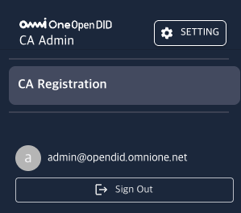

### 2.3.2. CA 등록 상태

CA 등록이 완료되면 전체 관리 기능이 활성화되며, 사이드바 메뉴는 다음과 같이 구성됩니다:

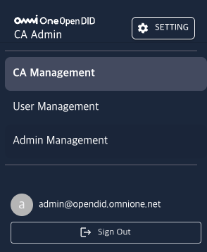

| 번호 | 기능 명칭 | 기능 설명 |
|------|-----------|-----------|
| 1 | **CA Management** | CA 서버의 기본 정보(DID, URL 등)를 확인하고 관리하는 메뉴입니다. |
| 2 | **User Management** | 시스템에 등록된 사용자 정보를 조회할 수 있는 메뉴입니다. 사용자의 개인 식별 정보(PII)를 확인할 수 있습니다. |
| 3 | **Admin Management** | 관리자 관련 설정을 관리하는 메뉴입니다. 관리자의 계정 및 권한을 조정할 수 있습니다. |

각 메뉴에 대한 상세 기능은 [3. 기능별 상세 메뉴얼](#3-기능별-상세-메뉴얼) 섹션에서 자세히 설명합니다.

<br/>

## 2.4. 비밀번호 변경 관리

사용자 비밀번호 변경은 다음 단계를 통해 수행할 수 있습니다:

1. 헤더 영역의 'SETTING' 버튼을 클릭합니다.
2. 설정 메뉴에서 '비밀번호 변경'을 선택합니다.
3. 비밀번호 변경 화면에서:
   - 현재 비밀번호 입력
   - 새 비밀번호 입력
   - 새 비밀번호 확인 입력
4. '저장' 버튼을 클릭하여 변경 사항을 적용합니다.

> **참고**: 비밀번호는 8자 이상, 64자 이하입니다.

<br/>

# 3. 기능별 상세 메뉴얼

이 장에서는 Open DID CA Admin Console의 주요 기능에 대한 상세 사용 방법을 안내합니다.

## 3.1. CA Management

CA Management는 CA 서버의 등록 및 상태 관리를 위한 기능입니다.  


CA 서버는 Open DID 시스템에서 사용자의 Client Application을 보증하는 역할을 수행합니다.    
Client Application은 CA 서버를 통해 인증된 후 Wallet을 사용하여 DID 생성, VC 발급 등의 주요 기능을 사용할 수 있습니다.

CA 등록은 최초 1회만 수행되며, 이후에는 관리 화면에서 등록된 상태를 확인할 수 있습니다.

<br/>

### 3.1.1. CA 등록

CA 서버가 아직 Open DID 시스템에 등록되지 않은 초기 상태에서는,  
CA Admin Console 좌측 메뉴에 `CA Registration` 항목만 표시됩니다.  

CA 등록은 총 3단계의 스텝을 통해 순차적으로 진행됩니다.


<br/>

**Step 1 - Enter CA Info**

CA의 정보를 입력하는 단계입니다.

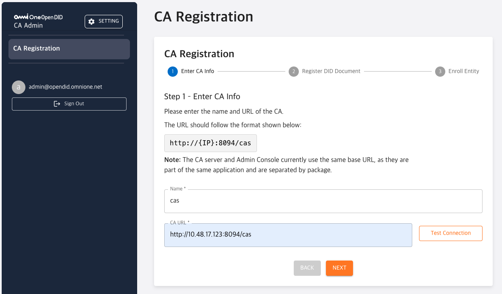

| 항목              | 설명                                                                 |
| ----------------- | -------------------------------------------------------------------- |
| **Name**          | CA 서버의 이름을 입력합니다. 예: `cas`                              |
| **CA URL**        | CA 서버의 호출 URL을 입력합니다. `http://<IP>:8094/cas` 형식 사용   |
| **Test Connection 버튼** | 입력한 URL로 실제 연결이 가능한지 확인합니다.                 |
| **NEXT 버튼**     | 다음 단계로 이동합니다.                                              |

<br/>

**Step 2 - Register DID Document**

이 단계에서는 CA의 DID Document를 생성하고 TA Admin에 등록을 요청합니다.   
한 번 등록된 DID Document는 **변경하거나 재등록할 수 없습니다.**

▶ **Step 2-1: Generate DID Document**

CA의 DID Document를 생성합니다.  

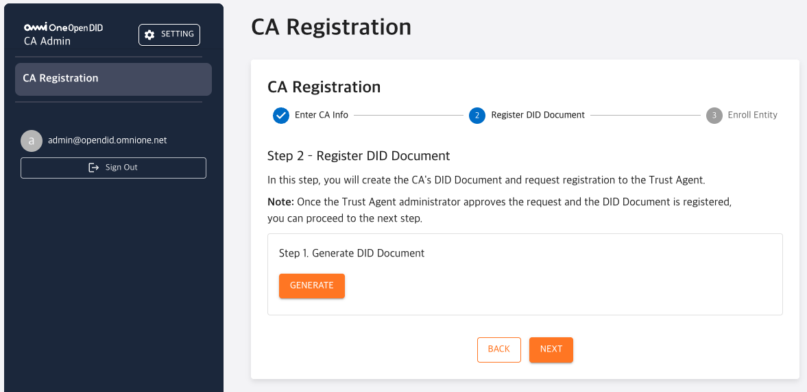

| 항목               | 설명                                                               |
| ------------------ | ------------------------------------------------------------------ |
| **GENERATE 버튼**  | CA 서버의 DID Document를 생성합니다. 생성 후 하단 영역에 결과 표시 |
| **요청 상태 표시** | 요청 성공 시 초록색 메시지로 확인 가능합니다.                      |

DID Document가 성공적으로 생성되면, **Step 2-2 영역이 화면에 자동으로 표시됩니다.**

<br/>

▶ **Step 2-2 - Submit Registeration Request**

생성된 DID Document를 TA Admin에 등록 요청합니다.

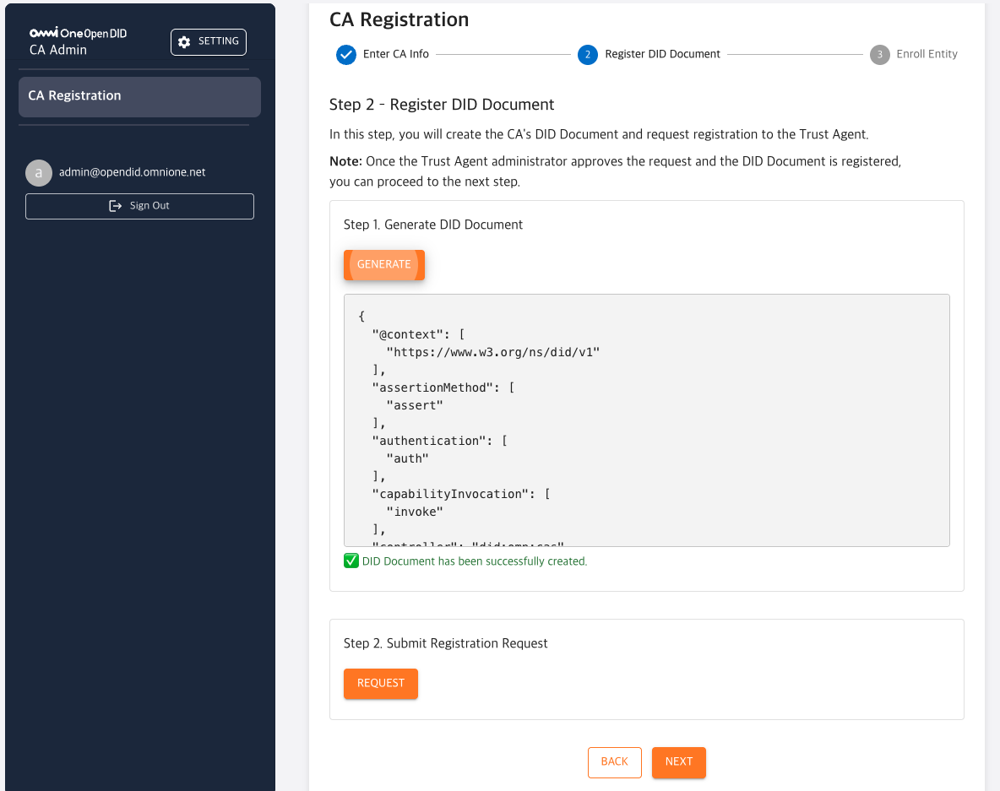
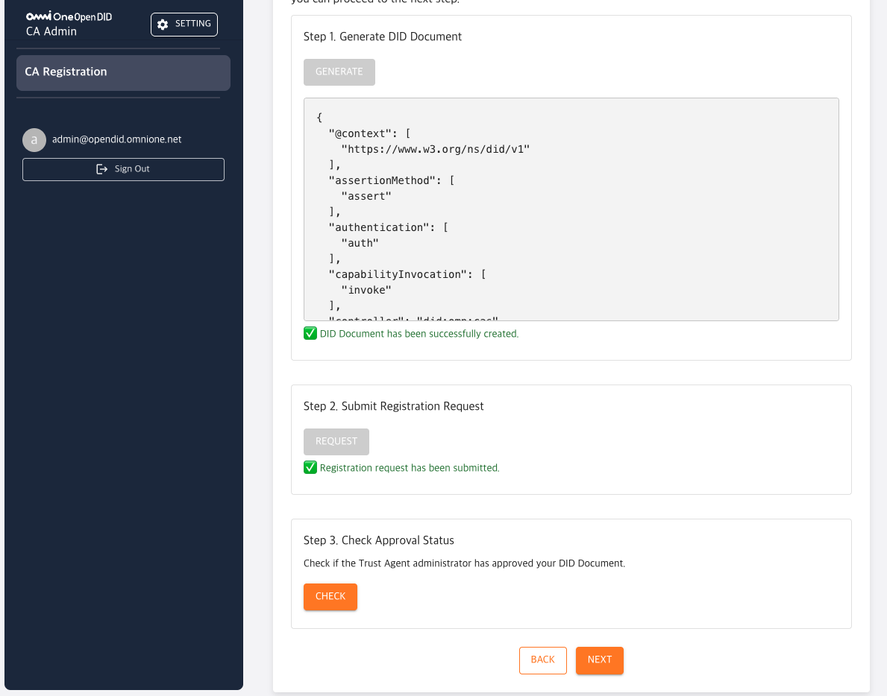

| 항목              | 설명                                                                 |
| ----------------- | -------------------------------------------------------------------- |
| **REQUEST 버튼**  | 생성한 DID Document에 대한 등록 요청을 TA Admin에 보냅니다.        |
| **요청 상태 표시** | 요청 성공 시 초록색 메시지로 확인 가능합니다.                        |

DID Document가 성공적으로 생성되면, **Step 2-3 영역이 화면에 자동으로 표시됩니다.**

<br/>

▶ **Step 2-3 - Check Approval Status**

TA 관리자가 DID Document 등록 요청을 승인했는지 확인합니다.

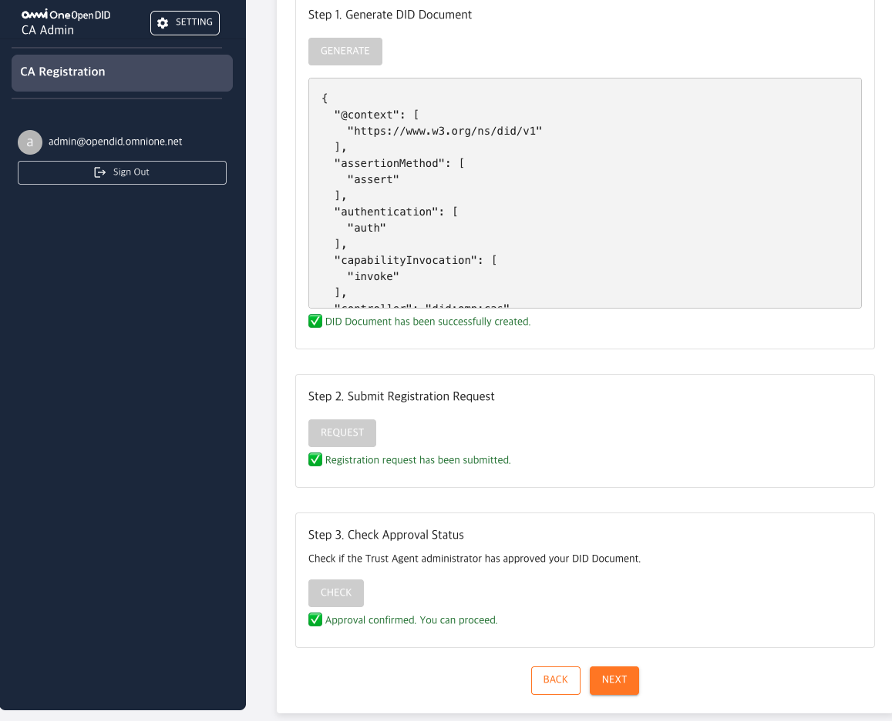

| 항목              | 설명                                                                 |
| ----------------- | -------------------------------------------------------------------- |
| **CHECK 버튼**    | TA 관리자가 등록 요청을 승인했는지 확인합니다.                      |
| **승인 상태 표시** | 승인 완료 시 초록색 메시지와 함께 다음 단계로 이동할 수 있습니다.     |

<br/>


**Step 3 - Enroll Entity**

TA 서버에 CA를 Entity로 등록 요청하고, 가입증명서(Certificate VC)를 발급받는 단계입니다. 

이때 등록 요청은 TA 프로토콜 중 사용자 등록 프로토콜(P132)의 흐름을 따르며,  
CA Admin이 해당 프로토콜의 API들을 호출하여 등록 절차를 수행합니다.

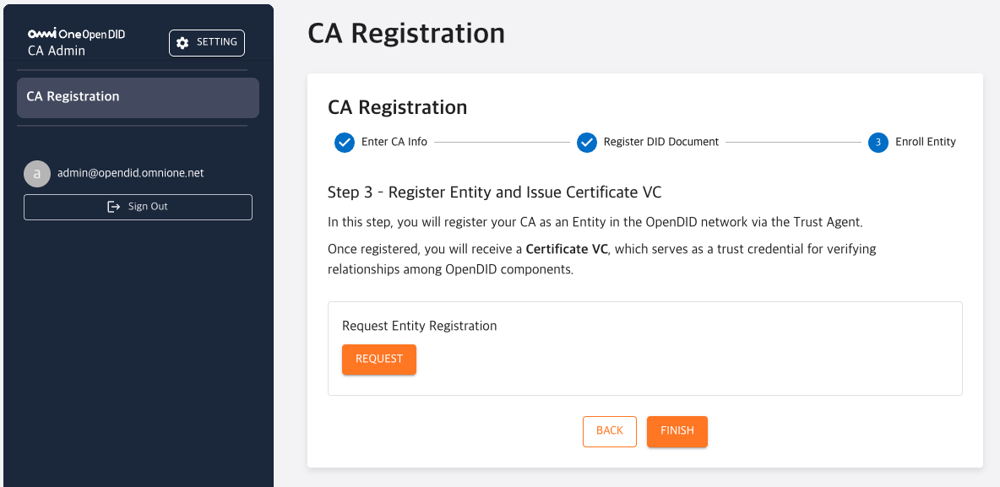
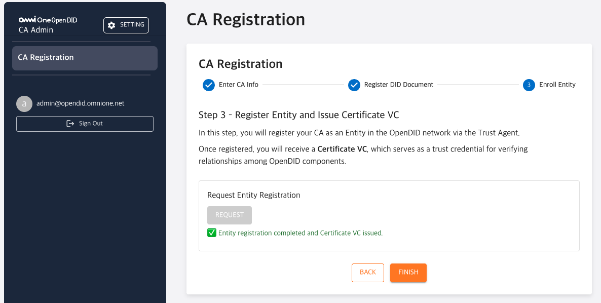

| 항목        | 설명                                       |
| ----------- | ------------------------------------------ |
| **REQUEST** | TA 서버에 Entity 등록 요청을 보냅니다.     |
| **FINISH**  | 등록을 마치고 최종 완료 상태로 이동합니다. |

<br/>


### 3.1.2. 등록된 CA 관리

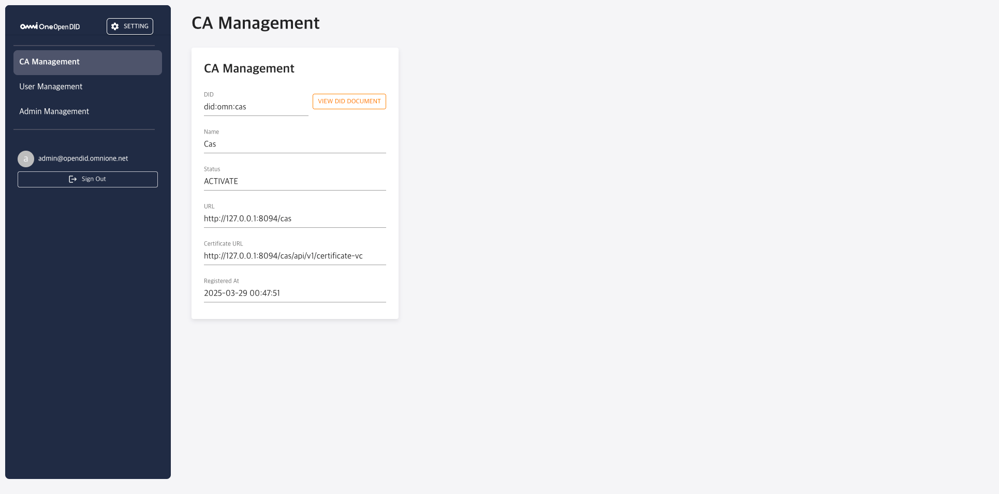

| 번호 | 항목              | 설명                                                                                                                                                   |
| ---- | ----------------- | ------------------------------------------------------------------------------------------------------------------------------------------------------ |
| 1    | **DID**               | CA의 고유 식별자입니다. 형식은 'did:omn:ca'와 같은 형태로 표시됩니다.                                                                                  |
| 2    | **Name**              | CA의 이름입니다. VC 발급 시 표시되는 이름입니다.                                                                                                       |
| 3    | **Status**            | CA의 활성화 상태를 나타냅니다. ACTIVATE 또는 DEACTIVATE 상태가 표시됩니다.                                                                             |
| 4    | **URL**               | CA 서비스의 기본 URL 주소입니다.                                                                                                                       |
| 5    | **Certificate URL**   | CA의 가입증명서를 확인할 수 있는 URL 주소입니다.                                                                                                       |
| 6    | **Registered At**    | CA가 등록된 날짜와 시간을 표시합니다.                                                                                                                  |
| 7    | **VIEW DID DOCUMENT** | DID 문서를 확인할 수 있는 버튼입니다. 클릭 시 팝업 형태로 블록체인에 등록된 DID 문서 정보가 표시됩니다.                                                |

<br/>

## 3.2. User Management

User Management 메뉴는 시스템에 등록된 사용자 정보를 조회하는 기능을 제공합니다. 이 기능을 통해 관리자는
사용자의 개인 식별 정보(PII)를 확인할 수 있습니다.

### 3.2.1. 사용자 목록 조회

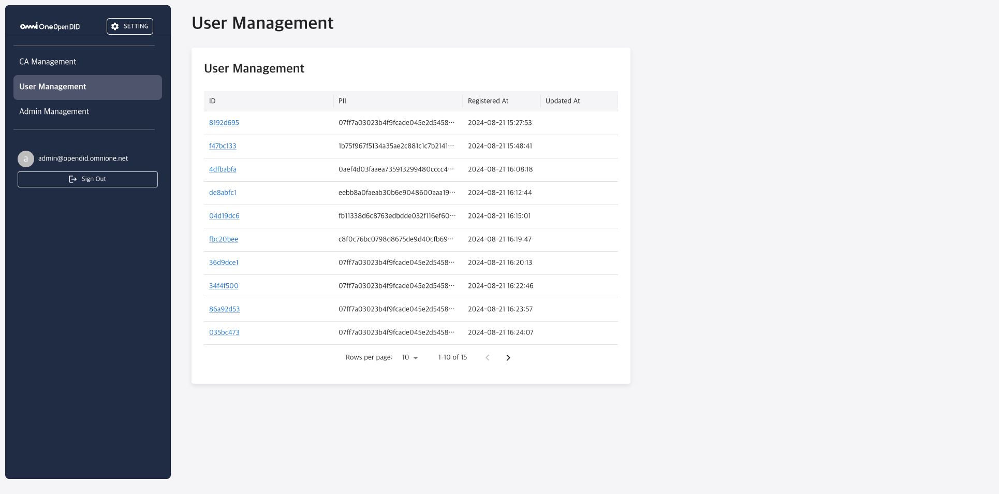

User Management 화면은 다음과 같은 주요 정보를 표시합니다:

| 번호 | 항목 | 설명 |
|------|------|------|
| 1 | ID | 사용자의 고유 식별자입니다. 클릭하면 상세 정보를 볼 수 있습니다. |
| 2 | PII | 사용자의 개인 식별 정보입니다. |
| 3 | Registered At | 사용자가 등록된 날짜와 시간을 표시합니다. |
| 4 | Updated At | 사용자 정보가 마지막으로 업데이트된 날짜와 시간을 표시합니다. |
| 5 | 페이지네이션 | 사용자 목록의 페이지를 관리합니다. 한 페이지당 표시할 행 수와 현재 페이지 정보를 확인할 수 있습니다. |

> **참고**: 사용자 목록 화면에서는 읽기만 가능하며, 사용자 정보의 추가, 수정, 삭제 기능은 제공되지 않습니다.

<br/>

### 3.2.2. 사용자 상세 정보 조회

사용자 목록에서 사용자 ID를 클릭하면 해당 사용자의 상세 정보를 조회할 수 있습니다.

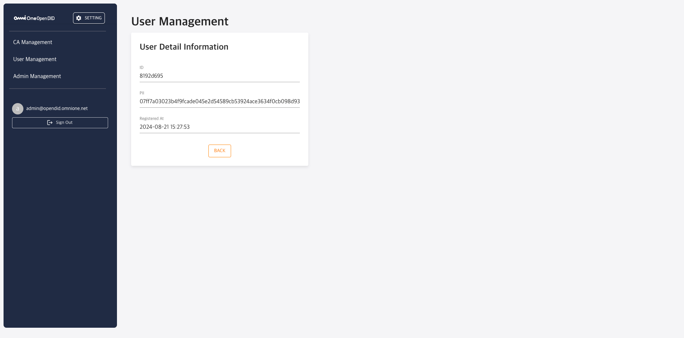

사용자 상세 정보 화면에는 다음과 같은 정보가 표시됩니다:

| 섹션 | 포함 정보 |
|------|-----------|
| **기본 정보** | - ID<br>- PII<br>- Registered At<br>- Updated At |

> **중요**: 개인 식별 정보(PII)는 현재 시스템상 Demo Server를 통해 입력받은 임의의 값입니다. CA서버는 사용자 정보를 갖고 있는 설정을 위해 해당 조회 기능을 제공합니다.

을 적용합니다.

<br/>

## 3.3. Admin Management

`Admin Management` 메뉴는 CA Admin Console에 접근할 수 있는 관리자 계정을 관리하는 기능입니다.  

CA 서버를 설치하면 기본적으로 `admin@opendid.omnione.net` 계정이 ROOT 권한으로 자동 생성됩니다.  
이 계정은 시스템 내 유일한 ROOT 계정이며, 삭제할 수 없습니다.

관리자 계정은 **ROOT**와 **Normal Admin** 두 가지 권한 유형으로 구분됩니다.  
ROOT 계정은 `Admin Management` 메뉴에서 모든 기능을 수행할 수 있으며, Normal Admin은 일반적인 조회 기능만 가능합니다.

---
> **참고:** 현재는 ROOT 계정과 Normal Admin 계정 간의 권한 차이는  
> `Admin Management` 메뉴에서 표시되는 버튼의 차이(Root만 REGISTER / DELETE / CHANGE PASSWORD 가능) 외에는 없습니다.  
> 그 외 시스템의 다른 메뉴에 대한 접근 권한이나 기능 제한은 아직 적용되어 있지 않습니다.
---

<br/>

### 3.3.1 Admin 목록 조회


`Admin Management` 메뉴에 진입하면 등록된 관리자 계정들의 목록이 테이블 형태로 표시됩니다.

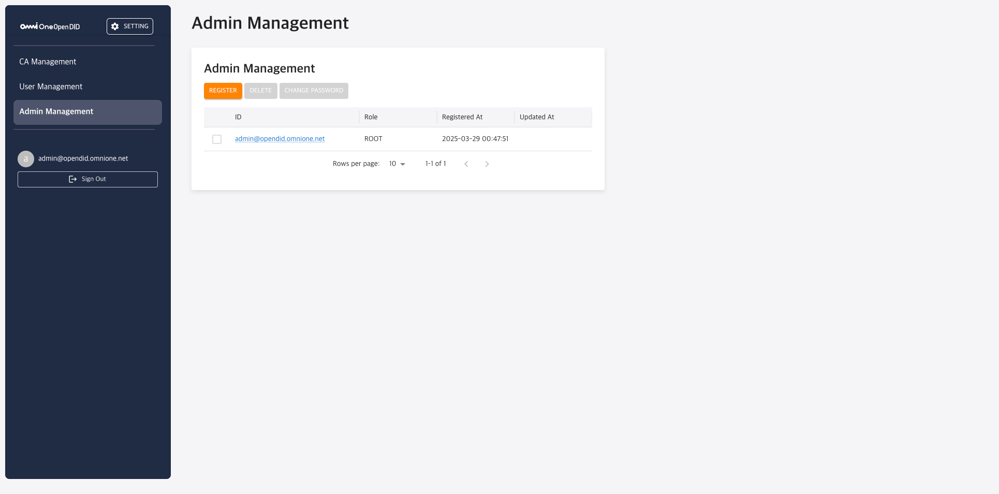


| 번호 | 항목                    | 설명                                                             |
| ---- | ----------------------- | ---------------------------------------------------------------- |
| 1    | **REGISTER 버튼**       | 새로운 관리자 계정을 등록할 수 있는 등록 페이지로 이동합니다.       |
| 2    | **DELETE 버튼**         | 선택한 관리자 계정을 삭제합니다. (ROOT 관리자만 가능)              |
| 3    | **CHANGE PASSWORD 버튼** | 선택한 관리자 계정의 비밀번호를 변경할 수 있습니다.                |
| 4    | **ID**                  | 등록된 관리자 계정의 이메일 ID입니다.                              |
| 5    | **Role**                | 해당 관리자 계정의 역할(Role)입니다. (예: ROOT, Normal Admin 등)   |
| 6    | **Registered At**       | 해당 계정이 최초 등록된 일시입니다.                               |
| 7    | **Updated At**          | 마지막으로 수정된 일시입니다.     

<br/>

### 3.3.2. Admin 등록

`Admin Management` 화면에서 **REGISTER** 버튼을 클릭하면, 아래와 같은 등록 화면으로 이동합니다.

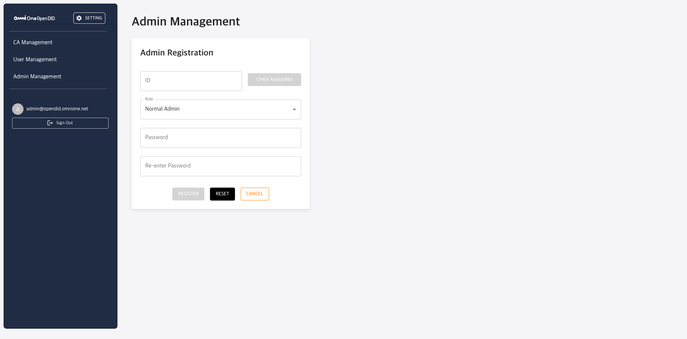

| 번호 | 항목                        | 설명                                                                |
| ---- | --------------------------- | ------------------------------------------------------------------- |
| 1    | **ID**                      | 등록할 관리자 계정의 ID입니다. 이메일 형식을 사용해야 합니다.         |
| 2    | **Check Availability 버튼** | 입력한 ID가 중복되지 않는지 확인합니다.                             |
| 3    | **Role**                    | 등록할 관리자 계정의 권한을 선택합니다. (예: Normal Admin)           |
| 4    | **Password**                | 로그인 시 사용할 비밀번호를 입력합니다.                              |
| 5    | **Re-enter Password**       | 비밀번호를 한 번 더 입력하여 일치 여부를 확인합니다.                |
| 6    | **REGISTER 버튼**           | 입력한 정보를 바탕으로 관리자 계정을 등록합니다.                    |
| 7    | **RESET 버튼**              | 모든 입력값을 초기화합니다.                                         |
| 8    | **CANCEL 버튼**             | 등록을 취소하고 이전 화면으로 돌아갑니다.                           |


[Open DID Installation Guide]: https://github.com/OmniOneID/did-release/blob/main/release-V1.0.0.0/OepnDID_Installation_Guide-V1.0.0.0.md


